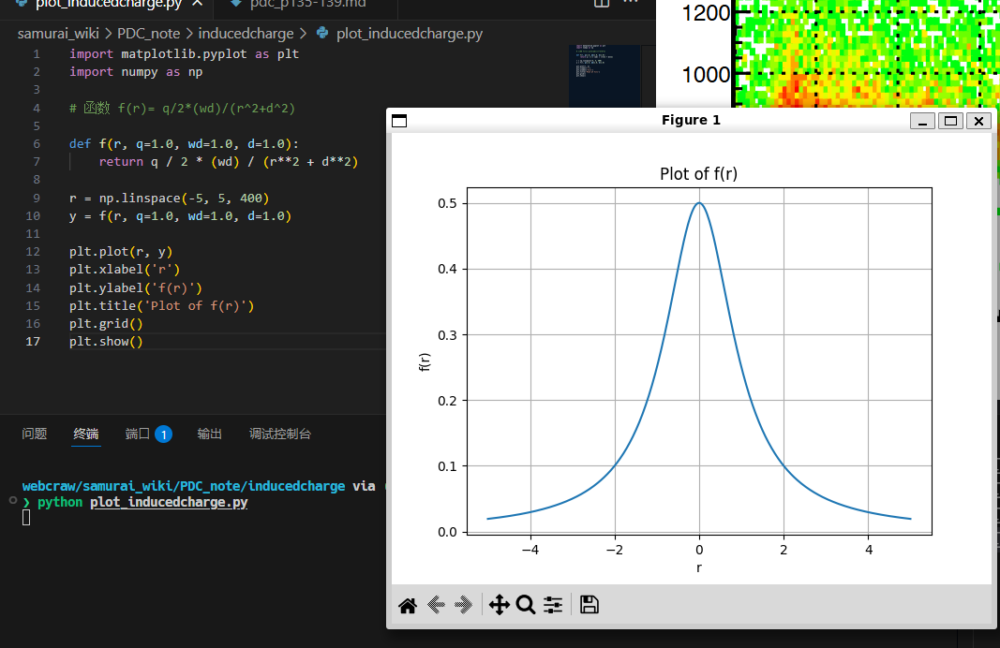
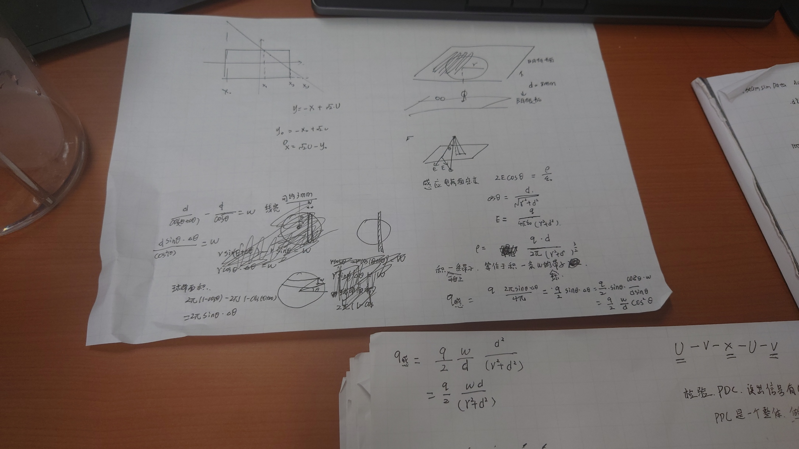
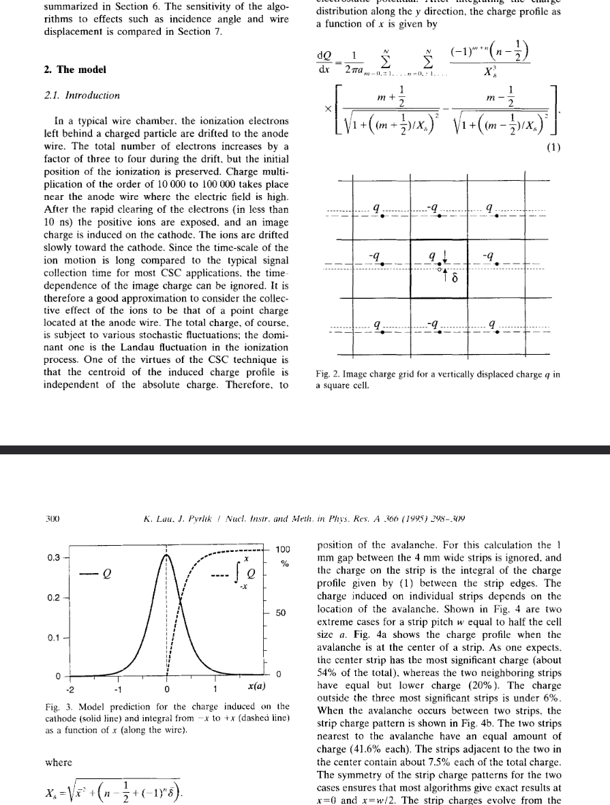

# 漂移室中感应电荷的分析与重心算法优化

## 1 引言：感应电荷在粒子物理探测中的核心作用

在粒子物理实验中，精确测量带电粒子穿过探测器时的位置至关重要。阴极条读出室（Cathode Strip Chambers, CSC）或更广义的漂移室，作为一种重要的气体探测器，通过测量雪崩过程中在阴极上产生的感应电荷分布来实现高精度的位置测量。与依赖漂移时间的传统方法相比，基于感应电荷分布的重心计算法（centroid-finding）对阳极丝的机械精度要求较低，使其在大面积、高分辨率探测器（如 LHC 的 μ 子探测器）中具有显著的成本效益和应用前景。

本文结合两篇关键文献——Lau 和 Pyrlik 的《阴极条室重心算法优化》（NIMA A366, 1995）以及 Roger 等人的《MAYA 主动靶的径迹追踪算法》（NIMA A638, 2011）——深入探讨感应电荷的产生机理、分布模型以及用于径迹重建的各种重心算法。

## 2 感应电荷的产生与分布模型

### 2.1 物理过程

当带电粒子穿过漂移室气体时，会电离气体分子产生电子—离子对。电子在电场作用下向阳极丝漂移，并在靠近阳极丝的高场区发生雪崩倍增，形成大量电子和正离子。

1. 电荷感应：雪崩产生的正离子云缓慢向阴极移动。根据 Shockley–Ramo 定理，这个移动的离子云会在周围电极（特别是阴极）上感应出镜像电荷。  
2. 信号形成：阴极被分割成若干条带（strips），每个条带收集到的感应电荷量不同，形成依赖雪崩位置的电荷分布剖面（charge profile）。  
3. 近似模型：由于离子漂移速度远慢于信号收集时间，可将雪崩产生的离子云近似为位于阳极丝处的静态点电荷，此简化模型为所有重心计算的基础。

### 2.2 感应电荷的数学描述

Lau 和 Pyrlik 提供了一个静电学模型来描述感应电荷在连续阴极平面上的分布。对于方形截面的漂移室单元，可通过镜像电荷法求解。在忽略条带间隙的情况下，沿 x 方向（平行于阴极平面、垂直于阳极丝）的电荷密度 dQ/dx 可表示为复杂级数求和形式。该分布呈钟形（bell-shaped），半高宽约等于漂移室单元尺寸的一半，意味着最佳条带宽度（strip pitch）应与阳极—阴极距离相当，从而在 3–5 个条带上分布电荷，便于重心计算。

Roger 等人在为 MAYA 主动靶开发算法时指出，二维径迹投影是多个过程卷积的结果：
- 电离路径的数字化：电子向阳极丝漂移；  
- 点源感应：雪崩倍增在阴极板上感应出镜像电荷；  
- 能量损失加权：感应电荷与粒子在该位置的能量损失（dE/dx）成正比；  
- 几何积分：最终信号是感应电荷在六边形阴极垫（pad）上的积分。

他们使用的点源感应分布公式为：
\[
\sigma(x,y) \propto \sum_{n=0}^{\infty} \frac{(-1)^n(2n+1)L}{\big((2n+1)^2 L^2 + x^2 + y^2\big)^{3/2}}
\]
其中 L 为阳极丝到阴极板的距离。该公式与 Lau & Pyrlik 的模型本质一致。

## 3 重心定位算法（Centroid-Finding Algorithms）

目标是从若干阴极条带上的电荷 Q_i 精确推断雪崩的原始位置 x，旨在最小化系统误差与统计误差。

### 3.1 重心法 (Center of Gravity, COG)

最简单的方法，计算电荷分布的加权平均值：
\[
X_c = \frac{\sum_i x_i Q_i}{\sum_i Q_i}
\]
优点：计算简单。缺点：存在显著系统性误差与不连续性，尤其当雪崩在条带边缘或跨越条带时，会出现周期性 S 形误差与突变，难以校正，影响空间分辨率。

### 3.2 加权重心法 (Weighted COG, WCOG)

Lau & Pyrlik 提出利用 3 条带 COG（X_3）与 4 条带 COG（X_4）的误差特性：X_3 在条带中心误差为零，X_4 在条带边界误差为零。WCOG 用依赖于 X_3、X_4 的权重 f(X_3,X_4) 将两者线性组合：
\[
X_{\text{wcog}} = f(X_3,X_4)\,X_3 + \big(1 - f(X_3,X_4)\big)\,X_4
\]
该方法平滑地在两者间过渡，消除不连续性并显著减小系统误差。经过傅里叶级数校正，分辨率可从 >100 µm 提升到约 76 µm。

### 3.3 比值法 (Ratio Method)

仅使用三个相邻条带的电荷：中心峰值 Q_1、左侧 Q_3、右侧 Q_2，以电荷比 f_L = Q_3/Q_1、f_R = Q_2/Q_1 确定位置。一个常见形式为：
\[
X_{\text{ratio}} = \frac{w}{2}\cdot\frac{(1-f_L)-(1-f_R)}{(1-f_L)+(1-f_R)}
= \frac{w}{2}\cdot\frac{Q_2 - Q_3}{2Q_1 - Q_2 - Q_3}
\]
优点：系统误差连续，能在条带中心与边界给出精确解。缺点：对入射角敏感，非垂直入射时误差显著，基于垂直模型的校正效果有限。

### 3.4 经验函数拟合法

通过解析函数拟合观测到的电荷分布，从拟合参数直接得到重心位置。

#### 3.4.1 高斯拟合 (Gaussian)
\[
Q(x) = a_1 \exp\!\left(-\frac{(x-a_2)^2}{a_3^2}\right)
\]
其中 a_2 为重心。高斯拟合的系统误差与 WCOG 相似。

#### 3.4.2 双曲正割平方函数 (SECHS)
Lau & Pyrlik 发现 SECHS：
\[
Q(x) = \frac{a_1}{\cosh^2\!\left(\frac{\pi(x-a_2)}{a_3}\right)}
\]
极好地近似理论感应电荷分布。SECHS 的优点：
1. 最小的系统误差（约 40 µm）；  
2. 系统误差曲线平滑，可用单项傅里叶级数高效校正；  
3. 对入射角不敏感；  
4. 校正后分辨率最好：在 Lau & Pyrlik 原型上由 53.3 µm 提升至 45.8 µm。

Roger 等人在 MAYA 的六边形阴极垫上使用 SECHS 变体：在三个对称轴上寻找电荷极大值点，分别用 SECHS 计算精确位置，再拟合直线得到径迹。

## 4 结论与展望

1. 模型的重要性：静态点电荷模型足以描述感应电荷主要特征，并能预测不同算法的系统误差，为算法选择与优化提供理论依据。  
2. 算法选择标准：理想算法应具有连续且幅度小的系统误差，简单的 COG 因不连续性不推荐使用。  
3. SECHS 的优越性：对规则条形阴极和复杂六边形阴极均表现优异，因与物理模型高度吻合而具有最小系统误差与最佳分辨率。  
4. 系统误差校正：对于 WCOG、SECHS 等具有平滑系统误差的算法，基于傅里叶级数的逐点校正是提高分辨率的有效手段。
